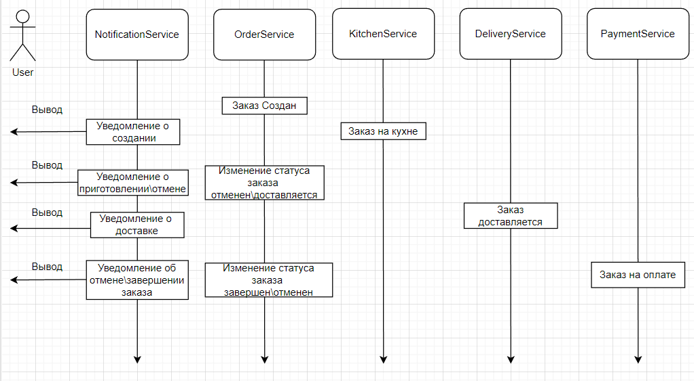

# Проект "Order"

## Описание проекта.

Данный проект, созданный на REST принципах, является частью учебного проекта для изучения микросервисной архитектуры. 
Центральная часть микросервисов доставки. 
Остальные части проекта:
[Сервис кухни по приготовлению блюд](https://github.com/SevaStopAll/job4j_kitchen)
[Сервис доставки](https://github.com/SevaStopAll/job4j_delivery)
[Сервис оплаты](https://github.com/SevaStopAll/job4j_payment)
[Сервис оптравки уведомлений](https://github.com/SevaStopAll/job4j_notification)

## Схема работы сервиса.

## Стек.

- **Java 17**
- **Spring Boot 2.7.10**
- **Spring Data**
- **PostgreSQL 14**
- **Lombok**

## Требования.

- **Java 17**
- **Maven 3.8**
- **PostgresSQL 14**

## Запуск проекта.
